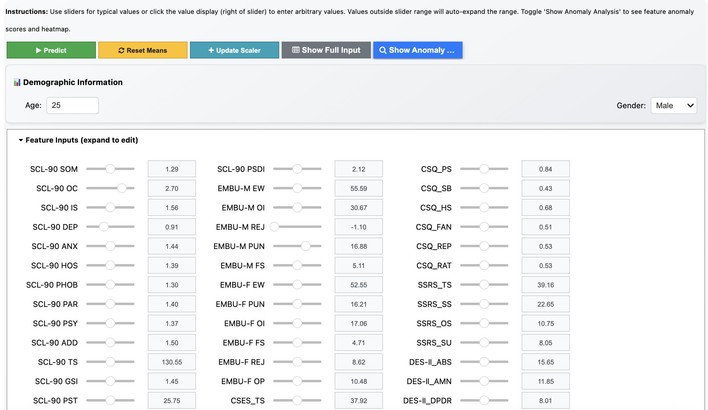
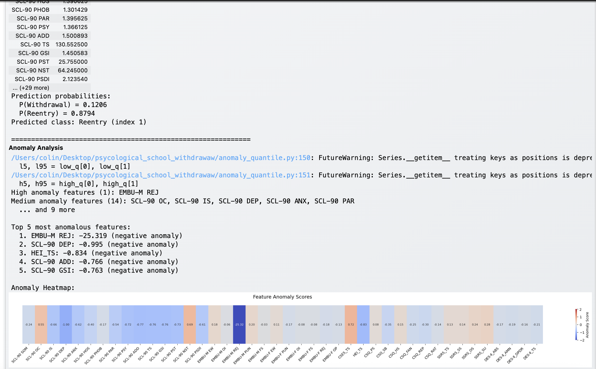

## Setup and usage guide

This guide shows how to set up the Python environment and run the full workflow: train models, plot importances and SHAP, generate risk probabilities, compute anomalies, and render anomaly heatmaps. Paths below assume you run commands from the repo root `/psycological_school_withdraw`.

**🚀 Quick Start:** Want to try the interactive prediction tool immediately? [](https://colab.research.google.com/drive/1yzJUVV3fH9Ev_-C7OZSGNkJ0AiZKJpWO?usp=sharing) - No installation required!

---

## Clone the repository

First, clone/download this [repository](https://github.com/SCoulY/psycological_school_withdrawal) to your local machine:

```bash
git clone git@github.com:SCoulY/psycological_school_withdrawal.git
cd psycological_school_withdrawal
```

Or if you prefer using HTTPS:

```bash
git clone https://github.com/SCoulY/psycological_school_withdrawal.git
cd psycological_school_withdrawal
```

---

## Install environment (Conda/Mamba + pip)
Install miniconda from [official website](https://www.anaconda.com/docs/getting-started/miniconda/install).

Create and activate a clean Conda/Mamba environment, then install Python packages from `requirements.txt`.

```powershell
# Create env (Python 3.11 matches cached files in this repo)
conda create -n school-withdrawal python=3.11 -y

# Activate it
conda activate school-withdrawal

# Install dependencies
pip install -r requirements.txt
```

Notes
- The requirements include numpy, pandas, scikit-learn, shap, seaborn, matplotlib, scipy, joblib, tqdm, etc.

---

## Interactive single-sample prediction

Run the notebook UI in IDE (e.g. [VS Code](https://code.visualstudio.com/download)) or [Google Colab](https://colab.research.google.com/) to interactively predict and explain one sample.

The UI is shown below: 


A sample prediction demo:


### Option 1: Run in Google Colab (Recommended for Quick Start)

[](https://colab.research.google.com/drive/1yzJUVV3fH9Ev_-C7OZSGNkJ0AiZKJpWO?usp=sharing)

**No installation required!** The notebook is fully self-contained and will:
- ✅ Automatically install all required packages
- ✅ Download the repository and model files from GitHub
- ✅ Set up the environment and verify file structure
- ✅ Provide an interactive UI with sliders and buttons

**Steps for Colab:**
1. Click the "Open in Colab" badge above
2. When prompted, click "Connect" to start a runtime
3. Run all cells: `Runtime` → `Run all` (or press `Ctrl+F9`)
4. Wait for setup to complete (~1-2 minutes for first run)
5. Expand the "Feature Inputs" accordion and adjust values
6. Click "Predict" to see risk assessment and anomaly analysis

**Colab Tips:**
- The notebook automatically detects Colab and handles setup
- Files are downloaded to `/content/psycological_school_withdrawal`
- All changes are temporary (lost when runtime disconnects)
- To save results, download them or connect to Google Drive
- See [COLAB_INSTRUCTIONS.md](COLAB_INSTRUCTIONS.md) for detailed guide
- See [TROUBLESHOOTING.md](TROUBLESHOOTING.md) if you encounter errors

### Option 2: Run Locally in IDE

For local execution with more control and persistent changes:

**Steps for Local IDE:**
1) Open `single_sample_inference.ipynb` in your IDE (VS Code, JupyterLab, etc.)
2) Select the Python kernel from the `school-withdrawal` env (Command Palette → "Python: Select Interpreter"). If prompted, install the IPython kernel into the env.
3) In the configuration cell, update parameters if needed:
   - `group_name`: Choose `'adults'`, `'teens'`, or `'children'`
   - `model_name`: Choose `'LogisticRegression'` or `'RandomForest'`
   - `top10`: Set `True` for top-10 features, `False` for all features
4) Run cells top-to-bottom. Provide feature values using sliders or click value displays to enter custom numbers
5) Click "Predict" to get risk probabilities and anomaly analysis with heatmap

---

## Troubleshooting

### Common Issues

**For Colab Users:**
- **FileNotFoundError**: Ensure the repository download cell completed successfully. Look for "✓ Repository downloaded successfully!" message
- **Module not found**: Re-run the package installation cell
- **Widgets not displaying**: Go to `Runtime` → `Restart runtime`, then run all cells again
- See [COLAB_INSTRUCTIONS.md](COLAB_INSTRUCTIONS.md) for detailed Colab-specific guidance
- See [TROUBLESHOOTING.md](TROUBLESHOOTING.md) for comprehensive troubleshooting

**For Local Users:**
- **Paths**: Prefer running from the repo root so relative paths like `ckpt/adults/*` resolve correctly
- **Fonts/plots**: If labels don't render, ensure matplotlib/seaborn fonts are installed or use default settings
- **Top-10 switch**: In `classifier.py`, `--disable_top10` defaults to True and uses a `store_true` flag. To train with top-10 features, you may need to change the default in the script or add a complementary flag
- **Missing files**: Verify you're in the correct directory with `pwd` and that all required files exist

---

---

## If you prefer using customised models, follow instructions to train models below
## Train classifiers

Run with defaults (adults dataset; all features since top-10 selection is disabled by default):

```bash
python classifier.py --file_path data/clean_adults.csv --train_both
```

---

Troubleshooting
- Paths: Prefer running from the repo root so relative paths like `ckpt/adults/*` resolve correctly.
- Fonts/plots: If labels don’t render, ensure matplotlib/seaborn fonts are installed or use default settings.
- Top-10 switch: In `classifier.py`, `--disable_top10` defaults to True and uses a `store_true` flag. To train with top-10 features, you may need to change the default in the script or add a complementary flag.


Arguments (partly shown)
- `--file_path` (str, default `data/clean_adults.csv`): Input CSV/XLSX of a cohort: `clean_adults.csv`, `clean_teens.csv`, or `clean_children.csv`.
- `--ckpt_path` (str|None, default `None`): If set to a `.pkl` checkpoint, the script loads it and reports metrics instead of training.
- `--classifier` (list[str], default `["SVM","RandomForest","LogisticRegression"]`): One or more models to train.
- `--train_both` (flag, default `False`): If True, train both top-10 and full feature models.
- `--scaler_path` (str|None, default `None`): Optional path to a saved scaler bundle to reuse scaling; otherwise a new scaler is fit and saved under `out_path`.

Outputs
- One model file per run per classifier (5 runs using seeds) saved in `out_path`.
- A scaler bundle `*_scaler.pkl` or `*_scaler_top10.pkl` saved in `out_path`.
- Console metrics: accuracy, precision/recall/F1, and AUC (mean ± std across runs).

Tips
- To train on teens or children, pass `--file_path data/clean_teens.csv` or `--file_path data/clean_children.csv` and adjust `--out_path` accordingly.

---

## Plot feature importances

Generates averaged feature-importance plots across 5-run checkpoints per model and cohort.

Run with portable relative paths:
```bash
python imp_plot.py --file_path data --ckpt_path ./ckpt/children --plot_path ./plot/
```

Default arguments (in the script; absolute paths are already set to this repo)
- `--file_path` (str, default `psycology/data`): Folder containing the cohort CSVs. The script infers which CSV to read from checkpoint filenames.
- `--ckpt_path` (str, default `psycology/ckpt/children/`): Folder with 5-run model `.pkl` files (LogisticRegression/RandomForest; SVM is skipped).
- `--plot_path` (str, default `psycology/plot/`): Output folder for the PDF figure.

Notes
- Checkpoints are grouped by naming; ensure you have 5 runs per model so means/SDs are meaningful.
- Output is saved as `importance_{cohort}_avg.pdf` in `plot_path`.

---

## Plot SHAP explanations 

Computes and aggregates SHAP values across checkpoints, then renders circular SHAP summary plots per model and feature set.

Run with portable relative paths:
```bash
python shap_explain.py --file_path ./data --ckpt_path ./ckpt/children --plot_path ./plot/shap_plot_children
```

Default arguments
- `--file_path` (str, default `/psycology/data`): Folder containing cohort CSVs.
- `--ckpt_path` (str, default `psycology/ckpt_5runs/children/`): Folder with trained checkpoints (LogisticRegression/RandomForest).
- `--plot_path` (str, default `psycology/plot/shap_plot_children`): Output folder for SHAP SVG files.

Outputs
- SVG plots named like `{table}_{model}_{top10|}.svg` in `plot_path`.

---

## Predict risk probabilities 
Generates per-student withdrawal risk probabilities by averaging predictions across 5-run checkpoints, then saves an Excel file.

Run with defaults (children, both top10 and full models):
```bash
python risk_prob_pred.py --file_path data/clean_children.csv --ckpt_path ckpt/children --predict_both
```

Arguments (partly shown)
- `--file_path` (str, default `data/clean_children.csv`): Input cohort CSV/XLSX.
- `--ckpt_path` (str, default `ckpt/children`): Folder containing trained model `.pkl` files.
- `--output_path` (str, default `risk_prob/`): Output folder for the Excel with predictions.
- `--scaler_path` (str, default `None`): Path to a scaler bundle to apply consistent scaling at inference. If not specified, trying to auto-detect the scaler under the `ckpt_path`. 

Outputs
- `{file_stem}_risk_prob.xlsx` with two new columns: `LogisticRegression` and `RandomForest` (class-1 probabilities), saved to `output_path`.

Tips
- Ensure checkpoints in `ckpt_path` match the feature setting for the age group from `file_path`

---

## Compute anomaly scores and quantiles

Builds KDE-based 5th/95th quantiles for "high-risk" and "low-risk" groups (split by predicted probabilities + ground truth), then assigns a signed anomaly score per feature. Now supports batch processing of multiple files.

Run (process all three groups in a single command):
```bash
python anomaly_quantile.py --file_path risk_prob/full/clean_adults_risk_prob_full.xlsx risk_prob/full/clean_teens_risk_prob_full.xlsx risk_prob/full/clean_children_risk_prob_full.xlsx
```

Arguments (defaults shown)
- `--file_path` (list[str], default `['risk_prob/full/clean_children_risk_prob.xlsx']`): Input Excel/CSV file(s) that include ground-truth `School Withdrawal/ Reentry Status` and model probability columns from step 5. Can specify multiple files for batch processing.
- `--kde_q_path` (str, default `quantiles`): Subdirectory name for saving quantile JSON files.
- `--output_path` (str, default `None`): Base folder to write final anomaly Excel files. If not specified, uses the directory of each input file.

Outputs
- `{input_dir}/quantiles/{cohort}_kde_q_high.json` and `..._low.json` with per-feature 5th/95th quantiles for each processed group.
- `{cohort}_anomaly.xlsx` in the output directory containing signed anomaly scores for all features of each group.ortances and

---

## Plot anomaly heatmaps

Renders ordered anomaly heatmaps for Adults/Teens/Children side-by-side for each model.

Run (set paths to your anomaly Excel files from step 6):
```bash
python sort_anomaly_plot.py --uncert_path risk_prob/top10 --output_path risk_prob/top10/anomaly_plot
```

Arguments (defaults in script use macOS-style absolute paths;)
- `--uncert_path` (str): Folder containing `adults_anomaly.xlsx`, `teens_anomaly.xlsx`, `children_anomaly.xlsx`.
- `--output_path` (str): Output folder for the combined PDF figure.
- `--disable_top10` (flag, default `False`): If present, plot “All features”; if omitted, plot “Top 10 features”.

Outputs
- `top10_anomaly.pdf` or `all_anomaly.pdf` in `output_path`.

---
